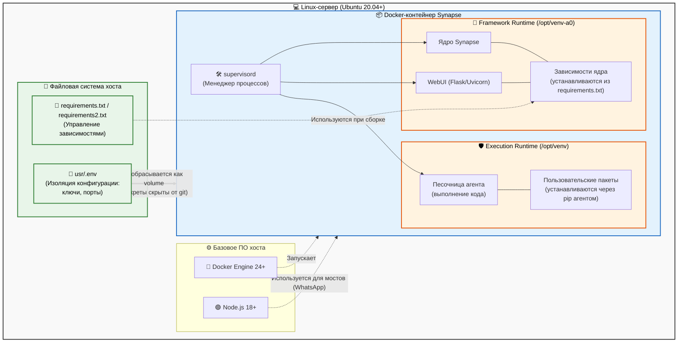
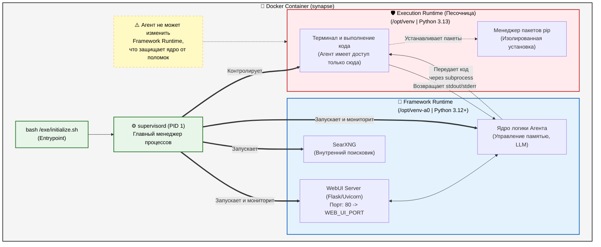
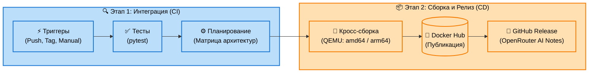

# Архитектура серверной инфраструктуры

Ниже представлена диаграмма архитектуры сервера, демонстрирующая изоляцию сред, управление зависимостями и конфигурацией. Вы можете использовать её для рендера (например, через плагин Markdown Preview или на сайте mermaid.live) и вставить скриншот в диплом.

---

# Структура Docker-контейнера

Эта диаграмма детально показывает внутреннее устройство контейнера: как супервизор управляет процессами и как именно достигается изоляция ИИ-агента (Execution Runtime) от ядра (Framework Runtime).

---

# Схема конвейера CI/CD

Эта диаграмма описывает процесс непрерывной интеграции и доставки (CI/CD) на базе GitHub Actions, включая кроссплатформенную сборку Docker-образов и ИИ-генерацию релизов.

